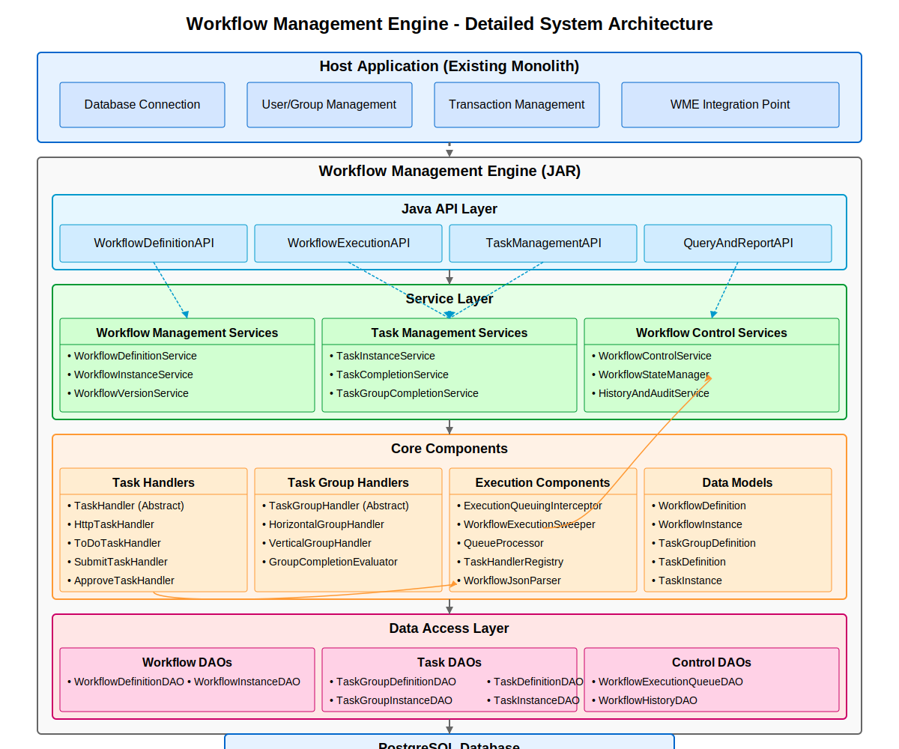
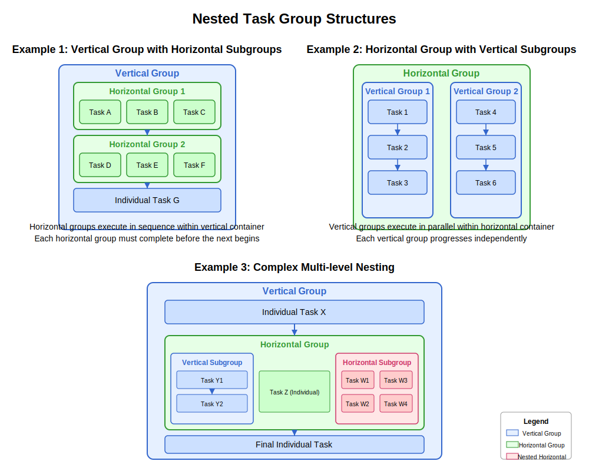
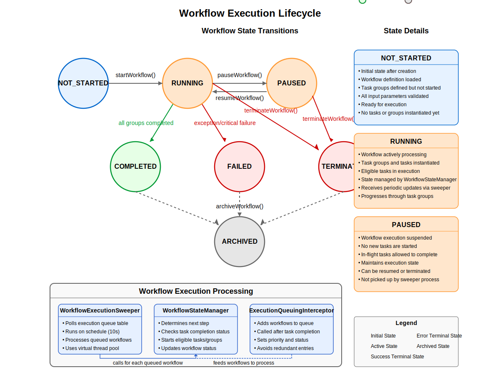
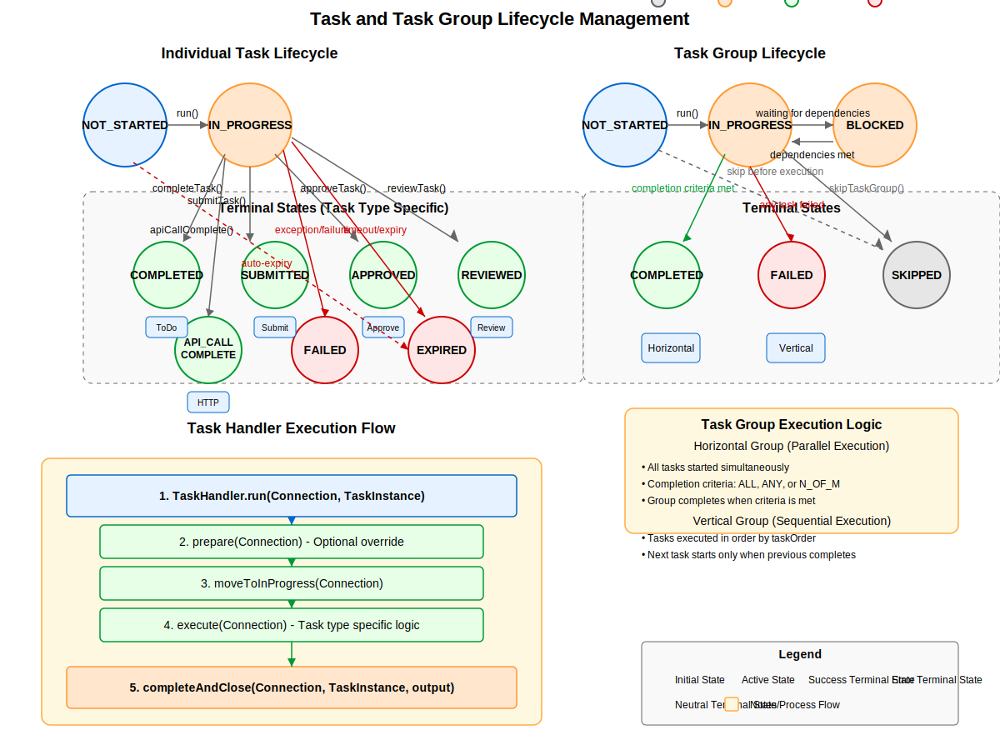
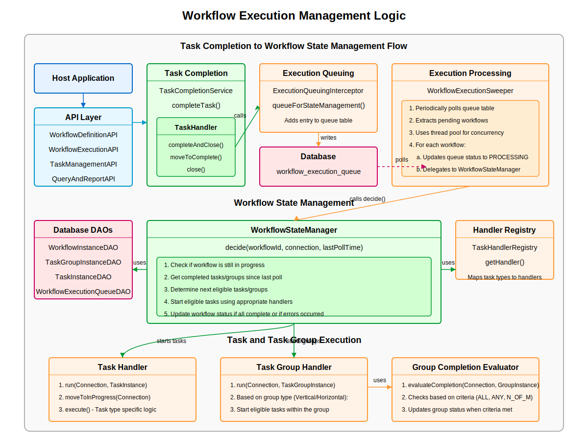
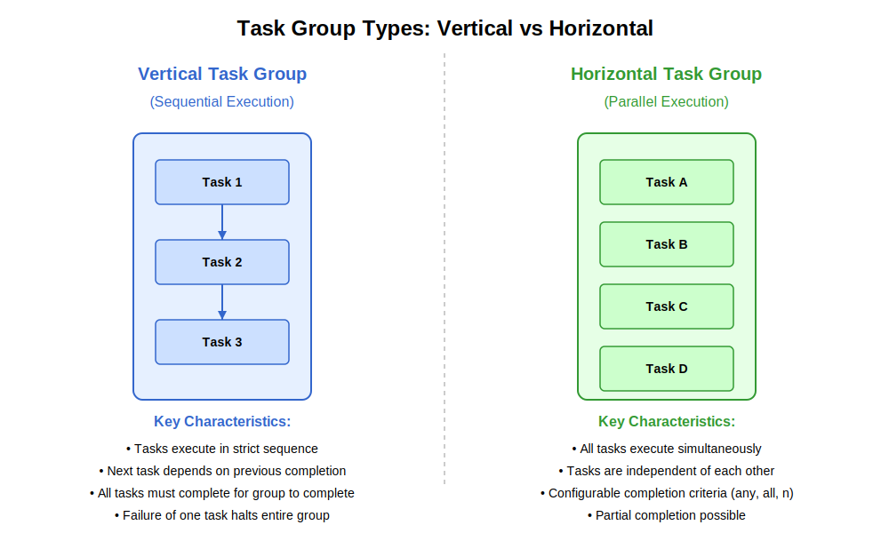
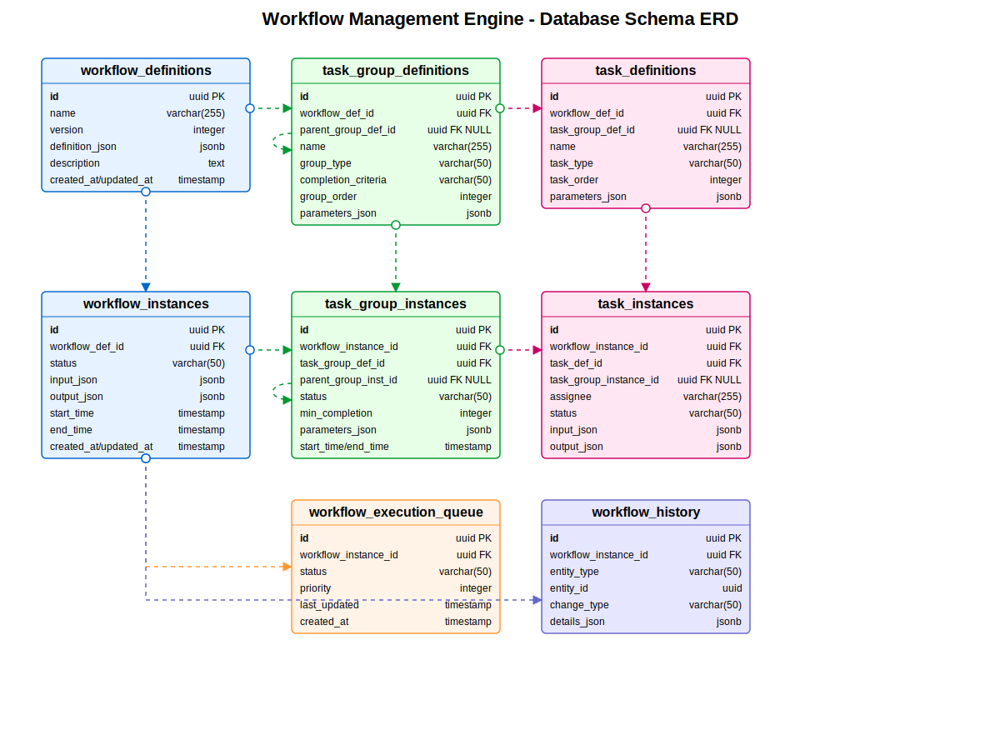
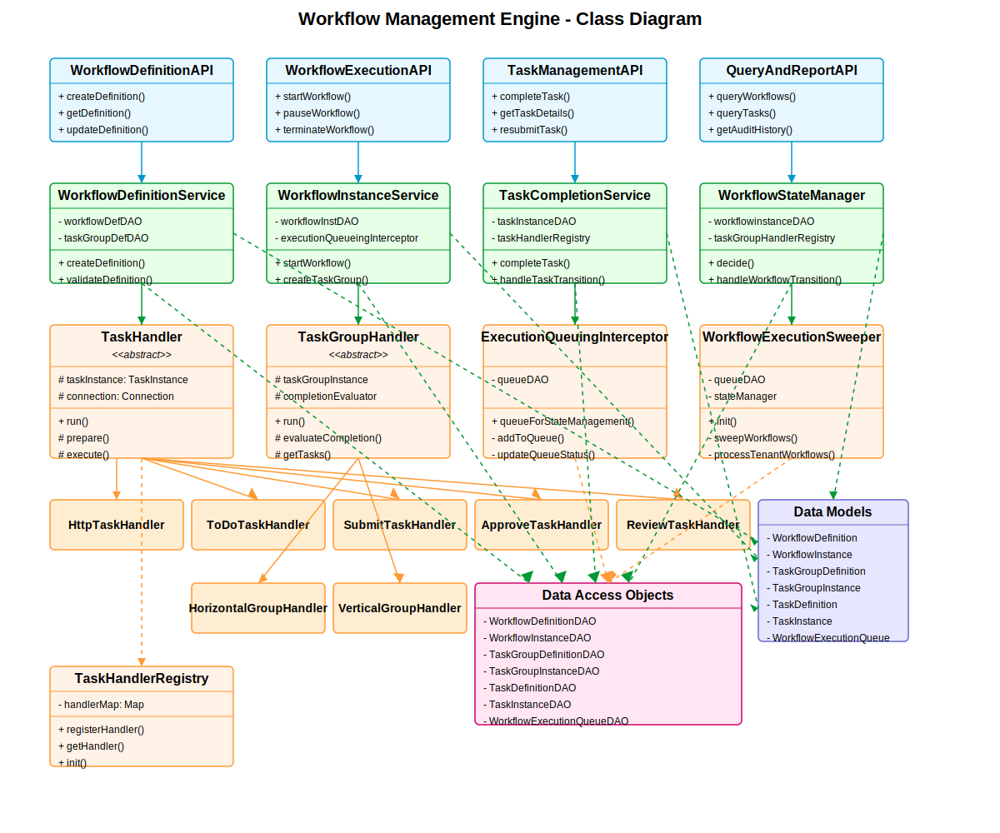
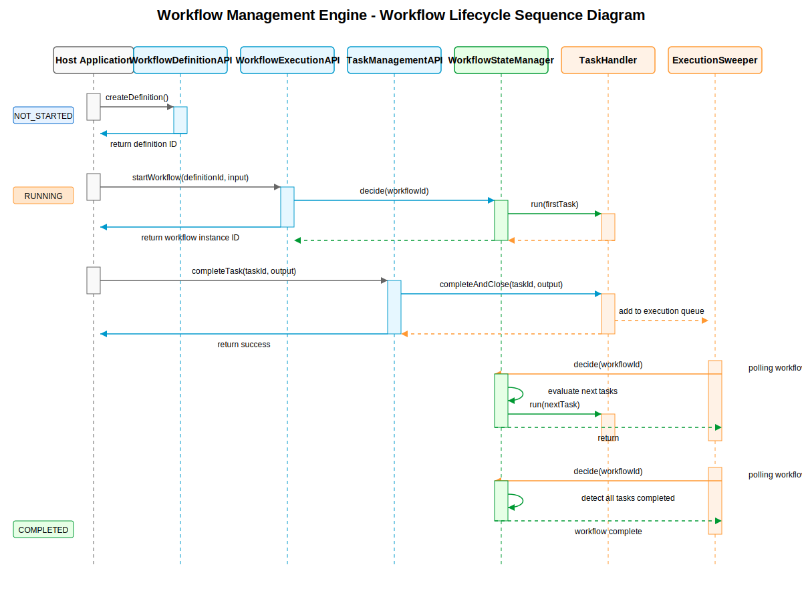

# Planning Workflow Engine (PWE)

A lightweight, embeddable, and extensible **Java-based workflow execution library** designed to manage task-oriented workflows in enterprise applications.

[](https://openjdk.java.net/)
[](https://gradle.org/)
[](https://www.postgresql.org/)
[](LICENSE)
[](https://github.com/workday/pwe)
[](https://github.com/workday/pwe)

## Table of Contents

- [Overview](#overview)
- [Key Features](#key-features)
- [Architecture](#architecture)
  - [Component Architecture](#component-architecture)
  - [Design Principles](#design-principles)
- [Core Concepts](#core-concepts)
  - [Workflow Definitions and Instances](#workflow-definitions-and-instances)
  - [Task Groups](#task-groups)
  - [Tasks](#tasks)
  - [Workflow Execution Lifecycle](#workflow-execution-lifecycle)
  - [Task Lifecycle](#task-lifecycle)
  - [Execution Flow](#execution-flow)
- [Supported Task Types](#supported-task-types)
  - [System Tasks](#system-tasks)
  - [Human Tasks](#human-tasks)
  - [Task Group Types](#task-group-types)
- [Database Model](#database-model)
- [Class Design](#class-design)
- [Sequence Flow](#sequence-flow)
- [Installation](#installation)
  - [Prerequisites](#prerequisites)
  - [Maven Configuration](#maven-configuration)
  - [Database Setup](#database-setup)
- [Configuration](#configuration)
  - [Core Configuration](#core-configuration)
  - [Database Configuration](#database-configuration)
  - [Execution Configuration](#execution-configuration)
- [Usage](#usage)
  - [Defining Workflows](#defining-workflows)
  - [Starting Workflows](#starting-workflows)
  - [Monitoring Workflow Status](#monitoring-workflow-status)
  - [Handling Tasks](#handling-tasks)
  - [Custom Task Handlers](#custom-task-handlers)
- [API Reference](#api-reference)
  - [Workflow Definition API](#workflow-definition-api)
  - [Workflow Execution API](#workflow-execution-api)
  - [Task Management API](#task-management-api)
  - [Query and Reporting API](#query-and-reporting-api)
- [Examples](#examples)
  - [Simple Approval Workflow](#simple-approval-workflow)
  - [Parallel Processing Workflow](#parallel-processing-workflow)
  - [Decision Tree Workflow](#decision-tree-workflow)
- [Development](#development)
  - [Building the Project](#building-the-project)
  - [Running Tests](#running-tests)
  - [Code Coverage](#code-coverage)
- [Contributing](#contributing)
- [License](#license)
- [Roadmap](#roadmap)
- [FAQ](#faq)

---

## Overview

The **Planning Workflow Engine (PWE)** is a robust, database-driven task orchestration engine designed for embedding within any Java application. Unlike standalone BPM (Business Process Management) solutions, PWE is specifically engineered to be integrated directly into your application codebase, providing seamless workflow capabilities without external dependencies.

PWE is intended to be embedded within a host monolithic application (specifically Workday Adaptive Planning) while maintaining a generic design to support various workflow patterns.

PWE excels at:

- Orchestrating complex business processes with human and system tasks
- Managing parallel execution paths with synchronization points
- Implementing decision-making logic based on process context
- Tracking complete lifecycle history of business workflows
- Providing resilient execution with fault tolerance and recovery
- Supporting versioning of workflow definitions
- Enabling both sequential and parallel execution patterns

The engine is built with enterprise applications in mind, focusing on reliability, scalability, and extensibility.

> **Design Philosophy**: PWE follows a pragmatic approach to workflow management, emphasizing simplicity in API design while providing powerful execution capabilities. It is designed to be understandable by developers without requiring specialized BPM knowledge.

---

## Key Features

- **Workflow Definition**: Define workflows using JSON/YAML with support for versioning and upgrades
- **Task Management**: Comprehensive task lifecycle management with status tracking
- **Group Structures**: Organize tasks in sequential or parallel groups with nested hierarchy support
- **Human Tasks**: Built-in support for human approval flows, reviews, and data entry
- **System Tasks**: Automatic execution of system tasks with custom handlers
- **Conditional Logic**: Branching based on workflow context and execution results
- **Parallel Execution**: Fork/join model for concurrent task processing
- **Retry Mechanisms**: Configurable retry policies with backoff logic
- **Error Handling**: Robust error management with fallback paths
- **Context Management**: Built-in context map for data sharing across tasks
- **State Persistence**: Complete state persistence in relational database
- **History & Audit**: Full audit trail of workflow execution and task completions
- **Monitoring**: Real-time monitoring of workflow progress
- **Extensibility**: Pluggable task handler architecture using Java interfaces
- **Embeddable Design**: Designed to be embedded directly in your application

---

## Architecture

PWE is built on a layered architecture that separates workflow definition, execution, and persistence concerns. The engine is designed to be modular, allowing for customization at various levels while maintaining a consistent execution model.

### Component Architecture

The high-level architecture consists of several key components that work together to enable workflow execution:



* **Core Engine**: Manages workflow state transitions and orchestrates task execution
* **Workflow Parser**: Parses workflow definitions from JSON/YAML
* **Task Handler Registry**: Maintains registry of task handlers for different task types
* **Execution Queue**: Prioritized execution queue for workflow instances
* **State Manager**: Manages state transitions and persistence
* **DAO Layer**: Data access objects for persisting workflow state
* **API Layer**: High-level APIs for interacting with the engine

### Design Principles

The PWE architecture adheres to the following design principles:

1. **Separation of Concerns**: Clear boundaries between definition, execution, and persistence
2. **Extensibility First**: Core components are designed for extension via interfaces
3. **Resilient Execution**: Built-in fault tolerance and recovery mechanisms
4. **Database Efficiency**: Optimized database access patterns for high throughput
5. **Stateless Operations**: Service components maintain no state between operations
6. **Transactional Integrity**: All state changes are atomic and transactional
7. **Thread Safety**: Components are designed for concurrent access
8. **Backward Compatibility**: API stability and migration paths for workflow definitions
9. **SOLID Principles**: Adherence to well-established object-oriented design principles

---

## Core Concepts

### Workflow Definitions and Instances

**WorkflowDefinition** represents the template or blueprint of a business process. It defines the structure, tasks, groups, and execution logic. Each definition has a unique identifier, name, version, and contains a collection of TaskGroupDefinitions and TaskDefinitions.

**WorkflowInstance** represents a running instance of a workflow definition. When a workflow is started, a new instance is created from the definition, and all tasks and groups are instantiated. The instance contains the runtime state, including task statuses, execution context, and history.

### Task Groups

Task groups provide a way to organize tasks and control their execution flow. Groups can be nested to create complex execution patterns.



Key concepts for task groups:

* **Group Type**: Determines how tasks are executed (VERTICAL for sequential, HORIZONTAL for parallel)
* **Completion Criteria**: Defines when a group is considered complete (ALL_TASKS, ANY_TASK, PERCENTAGE, etc.)
* **Nesting**: Groups can contain other groups to create complex execution hierarchies
* **Dependencies**: Groups can have dependencies on other groups or tasks

### Tasks

Tasks are the atomic units of work within a workflow. Each task has a specific type and goes through a defined lifecycle.

Tasks can be:
* **System Tasks**: Executed automatically by the engine using registered handlers
* **Human Tasks**: Require human intervention through an external interface
* **Conditional Tasks**: Evaluate expressions to determine execution path
* **Fork/Join Tasks**: Create and synchronize parallel execution paths

### Workflow Execution Lifecycle

A workflow instance progresses through a defined lifecycle from creation to completion:



1. **CREATED**: The workflow instance is created but not yet started
2. **RUNNING**: The workflow is actively executing tasks
3. **PAUSED**: Execution is temporarily suspended
4. **COMPLETED**: All tasks have completed successfully
5. **FAILED**: The workflow has encountered a terminal error
6. **CANCELLED**: The workflow was explicitly cancelled

The state transitions are managed by the WorkflowStateManager, which ensures that all transitions are valid and persisted properly.

### Task Lifecycle

Each task in a workflow goes through its own lifecycle:



1. **PENDING**: Task is defined but not yet eligible for execution
2. **READY**: Task is eligible for execution
3. **IN_PROGRESS**: Task is currently being executed
4. **COMPLETED**: Task has completed successfully
5. **FAILED**: Task has failed and may be retried
6. **CANCELLED**: Task was explicitly cancelled
7. **SKIPPED**: Task was skipped due to conditions

Tasks can transition between states based on execution results, retry policies, and manual interventions.

### Execution Flow

The execution flow within PWE follows a defined pattern:



1. **Workflow Scheduling**: A workflow instance is scheduled for execution
2. **Task Eligibility**: The engine determines which tasks are eligible for execution
3. **Handler Invocation**: Appropriate handlers are invoked for eligible tasks
4. **State Transitions**: Task states are updated based on execution results
5. **Group Completion**: Task group completion is evaluated
6. **Workflow Advancement**: The workflow advances to the next stage

The execution is managed by the WorkflowExecutionSweeper, which periodically scans for eligible tasks and workflows.

---

## Supported Task Types

PWE supports a variety of task types to accommodate different execution needs:

### System Tasks

* **HTTP Task**: Invokes external HTTP endpoints with configurable request parameters and response handling

### Human Tasks

* **Todo Task**: Simple task requiring human action
* **Submit Task**: Task for submitting work products
* **Approve Task**: Requires explicit approval action
* **Review Task**: Requires review and feedback

### Future Planned Task Types

* **Timer Task**: Time-based task execution
* **Decision Task**: Evaluates conditions and directs flow
* **Service Task**: Executes registered service methods
* **Script Task**: Executes scripts in supported languages
* **Notification Task**: Sends notifications to users or systems

### Task Group Types

Task groups determine how contained tasks are executed:



* **VERTICAL**: Tasks execute sequentially, one after another
* **HORIZONTAL**: Tasks execute in parallel

Groups can be nested to create complex execution patterns with mixed sequential and parallel execution.

### Completion Criteria
Task groups have configurable completion criteria:

* **ALL_TASKS**: All tasks must complete (default)
* **ANY_TASK**: Any one task must complete
* **PERCENTAGE**: A percentage of tasks must complete
* **SPECIFIC_COUNT**: A specific number of tasks must complete

### Future Task Group Types
* **CONDITIONAL**: Execute tasks based on conditional logic
* **FORK/JOIN**: Create parallel paths that synchronize at a join point

---

## Database Model

PWE uses a normalized relational schema to store workflow definitions, instances, tasks, and execution history:



Key tables include:

* **workflow_definitions**: Stores workflow templates with JSON definition
* **workflow_instances**: Running and completed workflow instances
* **task_group_definitions**: Definitions of task groups within workflows
* **task_definitions**: Individual task definitions
* **task_group_instances**: Runtime instances of task groups
* **task_instances**: Runtime instances of tasks
* **workflow_execution_queue**: Queue of workflows pending execution
* **workflow_history**: Complete audit trail of workflow and task transitions

The schema is designed for both operational performance and analytical querying, with appropriate indexing for common query patterns.

---

## Class Design

The core Java classes are structured into service, executor, and handler layers:



Key components include:

* **Service Layer**: Provides high-level APIs for workflow management
* **Handler Layer**: Implements task execution logic for different task types
* **Execution Layer**: Manages workflow and task state transitions
* **DAO Layer**: Handles persistence operations
* **Model Layer**: Contains domain objects representing workflow entities

The design follows object-oriented principles with clean separation of concerns and interfaces for extensibility.

---

## Sequence Flow

The internal processing flow from workflow scheduling to task execution follows this sequence:



1. Client code initiates a workflow instance
2. The WorkflowInstanceService creates and persists the instance
3. The instance is queued for execution
4. The WorkflowExecutionSweeper picks up the instance
5. The WorkflowStateManager transitions the workflow to RUNNING
6. TaskInstances are evaluated for eligibility
7. Eligible tasks are executed via appropriate TaskHandlers
8. Task completion triggers reevaluation of the workflow state
9. The process continues until the workflow completes or fails

This sequence ensures transactional integrity and proper state management throughout the execution lifecycle.

---

## Installation

### Prerequisites

* Java 17 or higher (Azul JDK preferred)
* Gradle 7.0+ or higher
* PostgreSQL 12+ or compatible RDBMS
* JDBC for database access
* External Tomcat deployment (for web applications)

### Gradle Configuration

Add the PWE dependency to your Gradle build file:

```gradle
dependencies {
    implementation 'com.workday:planning-workflow-engine:1.0.0-SNAPSHOT'
}
```

Additional dependencies you'll need:

```gradle
dependencies {
    // Database
    implementation 'org.postgresql:postgresql:42.6.0'
    
    // JSON processing
    implementation 'com.fasterxml.jackson.core:jackson-databind:2.14.2'
    
    // Logging
    implementation 'org.slf4j:slf4j-api:2.0.7'
    
    // Utility
    implementation 'org.apache.commons:commons-lang3:3.12.0'
    implementation 'com.google.guava:guava:31.1-jre'
}
```

### Database Setup

1. Create a database for PWE
2. Execute the schema creation scripts located in `src/main/resources/sql/schema.sql`
3. Apply indices from `src/main/resources/sql/indexes.sql`

---

## Configuration

### Core Configuration

Configure the PWE core with your application properties:

```properties
# Engine configuration
pwe.engine.threadpool-size=10
pwe.engine.sweep-interval-ms=5000
pwe.engine.max-execution-time-minutes=60

# Task configuration
pwe.task.default-retry-count=3
pwe.task.retry-delay-ms=5000
pwe.task.retry-backoff-factor=2.0

# Workflow configuration
pwe.workflow.max-instances=1000
pwe.workflow.context-max-size-kb=256
```

### Database Configuration

Configure database access:

```properties
# Database configuration
pwe.db.driver-class=org.postgresql.Driver
pwe.db.url=jdbc:postgresql://localhost:5432/pwe_db
pwe.db.username=pwe_user
pwe.db.password=*****
pwe.db.pool-size=10
pwe.db.connection-timeout-ms=30000
```

### Execution Configuration

Configure execution behavior:

```properties
# Execution configuration
pwe.execution.auto-start-workflows=true
pwe.execution.transaction-timeout-seconds=30
pwe.execution.max-parallel-tasks=50
pwe.execution.queue-priority-levels=5
```

### Host Application Integration

The host application must provide:

1. Database connection management
2. User and group information provision
3. Transaction control
4. Connection pooling

PWE is designed to use the database connections provided by the host application rather than managing its own connections.

---

## Usage

### Defining Workflows

Workflows can be defined using JSON format:

```json
{
  "name": "Expense Approval",
  "version": 1,
  "description": "Standard expense approval workflow",
  "taskGroups": [
    {
      "name": "Submission",
      "groupType": "VERTICAL",
      "completionCriteria": "ALL_TASKS",
      "tasks": [
        {
          "name": "Submit Expense",
          "taskType": "SUBMIT",
          "parameters": {
            "form": "expense-form",
            "requiredFields": ["amount", "category", "description"]
          }
        },
        {
          "name": "Initial Review",
          "taskType": "REVIEW",
          "parameters": {
            "reviewerRole": "FINANCE_TEAM",
            "autoApproveThreshold": 100
          }
        }
      ]
    },
    {
      "name": "Approval",
      "groupType": "CONDITIONAL",
      "completionCriteria": "ANY_TASK",
      "tasks": [
        {
          "name": "Manager Approval",
          "taskType": "APPROVE",
          "parameters": {
            "approverExpression": "${submission.managerEmail}",
            "escalationMinutes": 1440
          },
          "condition": "${expense.amount <= 1000}"
        },
        {
          "name": "Director Approval",
          "taskType": "APPROVE",
          "parameters": {
            "approverRole": "DIRECTOR",
            "escalationMinutes": 2880
          },
          "condition": "${expense.amount > 1000 && expense.amount <= 10000}"
        },
        {
          "name": "VP Approval",
          "taskType": "APPROVE",
          "parameters": {
            "approverRole": "VP",
            "escalationMinutes": 4320
          },
          "condition": "${expense.amount > 10000}"
        }
      ]
    },
    {
      "name": "Processing",
      "groupType": "VERTICAL",
      "completionCriteria": "ALL_TASKS",
      "tasks": [
        {
          "name": "Update Accounting System",
          "taskType": "HTTP",
          "parameters": {
            "url": "https://accounting-api.example.com/expenses",
            "method": "POST",
            "payload": {
              "amount": "${expense.amount}",
              "category": "${expense.category}",
              "employeeId": "${user.employeeId}"
            }
          }
        },
        {
          "name": "Send Notification",
          "taskType": "NOTIFICATION",
          "parameters": {
            "recipient": "${user.email}",
            "template": "expense-processed",
            "channel": "EMAIL"
          }
        }
      ]
    }
  ]
}
```

### Starting Workflows

Start a workflow using the WorkflowInstanceService:

```java
// Get the service through dependency injection
@Autowired
private WorkflowInstanceService workflowInstanceService;

// Create a context map with initial data
Map<String, Object> context = new HashMap<>();
context.put("expense", Map.of(
    "amount", 750.00,
    "category", "Travel",
    "description", "Flight to New York"
));
context.put("user", Map.of(
    "employeeId", "EMP123",
    "email", "john.doe@example.com"
));

// Start the workflow
UUID workflowDefId = UUID.fromString("550e8400-e29b-41d4-a716-446655440000");
UUID workflowInstanceId = workflowInstanceService.startWorkflow(workflowDefId, context);
```

### Monitoring Workflow Status

Monitor workflow progress:

```java
// Get status of a workflow instance
WorkflowInstance instance = workflowInstanceService.getWorkflowInstance(workflowInstanceId);
WorkflowStatus status = instance.getStatus();

// Get all tasks for a workflow instance
List<TaskInstance> tasks = taskInstanceService.getTasksForWorkflow(workflowInstanceId);

// Get active tasks only
List<TaskInstance> activeTasks = taskInstanceService.getActiveTasksForWorkflow(workflowInstanceId);

// Get workflow history
List<WorkflowHistory> history = historyService.getWorkflowHistory(workflowInstanceId);
```

### Handling Tasks

Complete a human task:

```java
// Get the task service
@Autowired
private TaskInstanceService taskInstanceService;

// Complete an approval task
Map<String, Object> result = new HashMap<>();
result.put("approved", true);
result.put("comments", "Expense looks reasonable");

taskInstanceService.completeTask(taskInstanceId, result);
```

### Custom Task Handlers

Implement a custom task handler:

```java
@Component
public class CustomIntegrationTaskHandler implements TaskHandler {

    @Override
    public String getTaskType() {
        return "CUSTOM_INTEGRATION";
    }

    @Override
    public void execute(TaskInstance taskInstance, Map<String, Object> context) {
        // Get task parameters
        JsonNode parameters = taskInstance.getParameters();
        String integrationId = JsonUtil.getStringValue(parameters, "integrationId");
        
        // Execute business logic
        try {
            // Your custom integration code here
            
            // On success, complete the task
            taskInstance.setStatus(TaskStatus.COMPLETED);
            taskInstance.setOutput(JsonUtil.toJsonNode(
                Map.of("status", "SUCCESS", "timestamp", new Date())
            ));
        } catch (Exception e) {
            // On failure, fail the task
            taskInstance.setStatus(TaskStatus.FAILED);
            taskInstance.setFailureReason(e.getMessage());
        }
    }
}
```

Register your custom handler:

```java
@Autowired
private TaskHandlerRegistry taskHandlerRegistry;

@PostConstruct
public void init() {
    taskHandlerRegistry.registerHandler(new CustomIntegrationTaskHandler());
}
```

---

## API Reference

### Workflow Definition API

```java
public interface WorkflowDefinitionAPI {
    UUID createWorkflowDefinition(String name, String description, JsonNode definition);
    UUID updateWorkflowDefinition(UUID workflowDefId, JsonNode definition);
    WorkflowDefinition getWorkflowDefinition(UUID workflowDefId);
    List<WorkflowDefinition> getWorkflowDefinitionsByName(String name);
    WorkflowDefinition getLatestWorkflowDefinition(String name);
    List<WorkflowDefinition> getAllWorkflowDefinitions();
    void deleteWorkflowDefinition(UUID workflowDefId);
}
```

### Workflow Execution API

```java
public interface WorkflowExecutionAPI {
    UUID startWorkflow(UUID workflowDefId, Map<String, Object> context);
    UUID startWorkflow(String workflowName, Map<String, Object> context);
    void pauseWorkflow(UUID workflowInstanceId);
    void resumeWorkflow(UUID workflowInstanceId);
    void cancelWorkflow(UUID workflowInstanceId, String reason);
    WorkflowInstance getWorkflowInstance(UUID workflowInstanceId);
    List<WorkflowInstance> getWorkflowInstances(WorkflowQueryDTO query);
    Map<String, Object> getWorkflowContext(UUID workflowInstanceId);
    void updateWorkflowContext(UUID workflowInstanceId, Map<String, Object> contextUpdates);
}
```

### Task Management API

```java
public interface TaskManagementAPI {
    List<TaskInstance> getTasksForWorkflow(UUID workflowInstanceId);
    List<TaskInstance> getActiveTasksForWorkflow(UUID workflowInstanceId);
    List<TaskInstance> getTasksForUser(String username);
    TaskInstance getTaskInstance(UUID taskInstanceId);
    void completeTask(UUID taskInstanceId, Map<String, Object> result);
    void assignTask(UUID taskInstanceId, String assignee);
    void skipTask(UUID taskInstanceId, String reason);
    void retryTask(UUID taskInstanceId);
}
```

### Query and Reporting API

```java
public interface QueryAndReportAPI {
    List<WorkflowHistory> getWorkflowHistory(UUID workflowInstanceId);
    List<TaskInstance> queryTasks(TaskQueryDTO query);
    WorkflowStatistics getWorkflowStatistics(UUID workflowDefId);
    List<TaskStatistics> getTaskStatistics(UUID workflowDefId);
    WorkflowStatusDistribution getStatusDistribution(String workflowName);
    List<AuditLogEntry> getAuditLog(UUID workflowInstanceId);
}
```

---

## Examples

### Simple Approval Workflow

```java
// 1. Define the workflow
JsonNode workflowDef = JsonUtil.fromString("""
{
  "name": "DocumentApproval",
  "version": 1,
  "taskGroups": [
    {
      "name": "ApprovalProcess",
      "groupType": "VERTICAL",
      "tasks": [
        {
          "name": "ManagerApproval",
          "taskType": "APPROVE",
          "parameters": {
            "approverRole": "MANAGER"
          }
        },
        {
          "name": "FinalizeDocument",
          "taskType": "HTTP",
          "parameters": {
            "url": "https://docapi.example.com/finalize",
            "method": "POST"
          }
        }
      ]
    }
  ]
}
""");

// 2. Register the workflow definition
UUID workflowDefId = workflowDefinitionService.createWorkflowDefinition(
    "DocumentApproval", "Simple document approval workflow", workflowDef);

// 3. Start a workflow instance
Map<String, Object> context = Map.of(
    "document", Map.of(
        "id", "DOC-123",
        "name", "Project Proposal",
        "author", "John Doe"
    )
);
UUID workflowInstanceId = workflowInstanceService.startWorkflow(workflowDefId, context);

// 4. Complete the approval task
TaskInstance approvalTask = taskInstanceService.getActiveTasksForWorkflow(workflowInstanceId)
    .stream()
    .filter(task -> task.getName().equals("ManagerApproval"))
    .findFirst()
    .orElseThrow();

taskInstanceService.completeTask(approvalTask.getId(), Map.of("approved", true, "comments", "Looks good!"));
```

### Parallel Processing Workflow

```java
// Define a parallel processing workflow
JsonNode workflowDef = JsonUtil.fromString("""
{
  "name": "DataProcessing",
  "version": 1,
  "taskGroups": [
    {
      "name": "DataPreparation",
      "groupType": "VERTICAL",
      "tasks": [
        {
          "name": "ValidateInput",
          "taskType": "SERVICE",
          "parameters": {
            "service": "dataValidationService",
            "method": "validate"
          }
        }
      ]
    },
    {
      "name": "ParallelProcessing",
      "groupType": "HORIZONTAL",
      "tasks": [
        {
          "name": "ProcessImages",
          "taskType": "SERVICE",
          "parameters": {
            "service": "imageProcessingService",
            "method": "process"
          }
        },
        {
          "name": "ProcessText",
          "taskType": "SERVICE",
          "parameters": {
            "service": "textProcessingService",
            "method": "process"
          }
        },
        {
          "name": "ProcessMetadata",
          "taskType": "SERVICE",
          "parameters": {
            "service": "metadataService",
            "method": "process"
          }
        }
      ]
    },
    {
      "name": "Finalization",
      "groupType": "VERTICAL",
      "tasks": [
        {
          "name": "MergeResults",
          "taskType": "SERVICE",
          "parameters": {
            "service": "resultMergingService",
            "method": "merge"
          }
        },
        {
          "name": "NotifyCompletion",
          "taskType": "NOTIFICATION",
          "parameters": {
            "channel": "EMAIL",
            "template": "processing-complete"
          }
        }
      ]
    }
  ]
}
""");
```

### Decision Tree Workflow

```java
// Define a decision tree workflow
JsonNode workflowDef = JsonUtil.fromString("""
{
  "name": "LoanApplication",
  "version": 1,
  "taskGroups": [
    {
      "name": "ApplicationSubmission",
      "groupType": "VERTICAL",
      "tasks": [
        {
          "name": "SubmitApplication",
          "taskType": "FORM",
          "parameters": {
            "formId": "loan-application"
          }
        },
        {
          "name": "VerifyIdentity",
          "taskType": "SERVICE",
          "parameters": {
            "service": "identityVerificationService",
            "method": "verify"
          }
        }
      ]
    },
    {
      "name": "CreditCheck",
      "groupType": "CONDITIONAL",
      "tasks": [
        {
          "name": "AutomaticApproval",
          "taskType": "SERVICE",
          "parameters": {
            "service": "loanApprovalService",
            "method": "autoApprove"
          },
          "condition": "${application.creditScore >= 750 && application.loanAmount <= 10000}"
        },
        {
          "name": "StandardReview",
          "taskType": "APPROVE",
          "parameters": {
            "approverRole": "LOAN_OFFICER"
          },
          "condition": "${application.creditScore >= 650 && application.creditScore < 750}"
        },
        {
          "name": "EnhancedReview",
          "taskType": "APPROVE",
          "parameters": {
            "approverRole": "SENIOR_LOAN_OFFICER",
            "minApprovers": 2
          },
          "condition": "${application.creditScore < 650 || application.loanAmount > 50000}"
        }
      ]
    },
    {
      "name": "Finalization",
      "groupType": "VERTICAL",
      "tasks": [
        {
          "name": "GenerateDocuments",
          "taskType": "SERVICE",
          "parameters": {
            "service": "documentGenerationService",
            "method": "generateLoanDocuments"
          }
        },
        {
          "name": "NotifyApplicant",
          "taskType": "NOTIFICATION",
          "parameters": {
            "channel": "EMAIL",
            "template": "loan-decision"
          }
        }
      ]
    }
  ]
}
""");
```

---

## Development

### Building the Project

To build the project:

```bash
./gradlew build
```

To skip tests:

```bash
./gradlew build -x test
```

### Running Tests

```bash
# Run all tests
./gradlew test

# Run specific test
./gradlew test --tests "com.workday.pwe.WorkflowExecutionTest"

# Run with coverage (add JaCoCo plugin to build.gradle first)
./gradlew test jacocoTestReport
```

### Code Coverage

If you've added the JaCoCo plugin to your build.gradle file:

```bash
open build/reports/jacoco/test/html/index.html
```

---

## Contributing

This repository is currently in active development. For contributions:

1. Fork the repository
2. Create a feature branch (`git checkout -b feature/amazing-feature`)
3. Commit your changes (`git commit -m 'Add some amazing feature'`)
4. Push to the branch (`git push origin feature/amazing-feature`)
5. Open a Pull Request

Please ensure your code follows the project's coding style and includes appropriate tests.

For major changes, please open an issue first to discuss the proposed changes.

---

## License

This project is licensed under the **Proprietary Workday License**. All rights reserved. See [LICENSE](LICENSE) for details.

---

## Roadmap

Upcoming features and improvements:

- **Workflow Versioning**: Enhanced support for versioning and migration
- **Dynamic Task Assignment**: Advanced assignment algorithms
- **SLA Management**: Comprehensive SLA tracking and escalations
- **Graphical Workflow Editor**: Web-based workflow definition tool
- **Analytics Dashboard**: Real-time workflow analytics
- **External Integration Connectors**: Pre-built connectors for common systems
- **Event-Driven Architecture**: Support for event-based workflow triggers
- **Multi-Tenancy**: Support for multi-tenant deployments
- **Mobile Support**: REST APIs optimized for mobile clients
- **Advanced Monitoring**: Enhanced monitoring and alerting

---

## FAQ

### General Questions

**Q: Can PWE be used as a standalone service?**  
A: PWE is designed as an embeddable library rather than a standalone service. However, you can create a service wrapper around it if needed.

**Q: Does PWE support BPMN?**  
A: PWE uses its own JSON/YAML-based workflow definition format, which is simpler than BPMN but covers many of the same concepts.

**Q: How does PWE compare to other workflow engines?**  
A: PWE is specifically designed for embedding within Java applications, with a focus on simplicity and integration rather than supporting the full BPMN specification.

### Technical Questions

**Q: What databases does PWE support?**  
A: PWE primarily supports PostgreSQL, but can work with any RDBMS supported by JDBC with appropriate schema adjustments.

**Q: How does PWE handle long-running workflows?**  
A: PWE stores all state in the database and uses a sweeper mechanism to periodically check for tasks that need execution, making it resilient for long-running workflows.

**Q: Can PWE workflows span multiple services?**  
A: Yes, using HTTP tasks, PWE can integrate with external services as part of a workflow.

**Q: How does PWE handle errors and retries?**  
A: PWE includes configurable retry policies with backoff support, and allows defining error handling paths in workflows.

---

&copy; 2025 Workday, Inc. All Rights Reserved.
